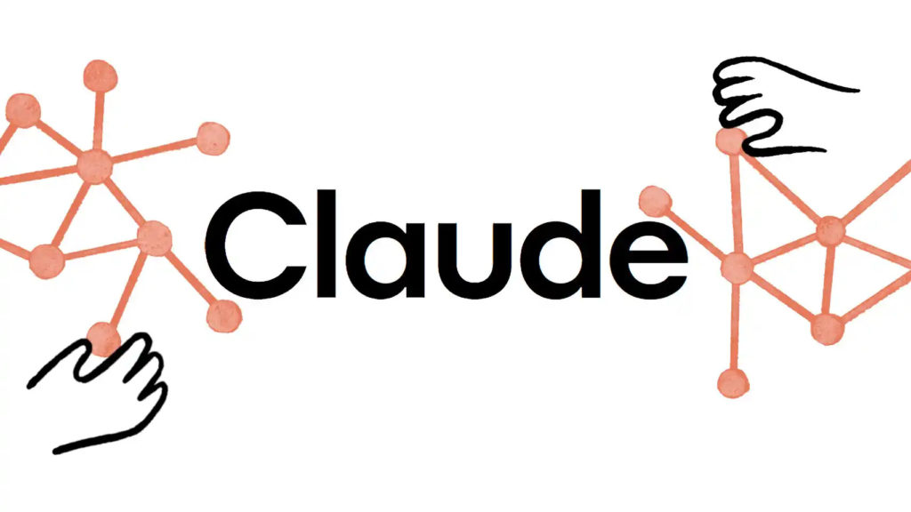

# Claude Everywhere: The Complete Ecosystem Guide

<figure><figcaption></figcaption></figure>

### Why choose this course?



### One AI, an Entire Ecosystem

Claude is more than a chatbot. It’s a connected system of products, from Claude.ai to Desktop, Cowork, and MCP, each built for different tasks. This course shows you what each one does, when to reach for it, and how they work together.



### Go Deep on the Features That Matter

Claude.ai includes features such as Projects, Memory, Artifacts, tools, and document workflows that are often underutilized. Each component supports working with files, data, and long-running context effectively.



### Connect Claude to the Tools You Already Use

Claude Desktop gives you local file access. MCP connects Claude to external apps and data sources. Cowork handles multi-step tasks autonomously. You’ll set up each one and learn when to delegate instead of doing everything in a chat window.



### Walk Away with a System, Not Just Skills

The course ends where your daily work begins. You’ll build a personal Claude workflow tailored to your role, combining prompt patterns, product choices, and task strategies into a repeatable system you can use from day one.



***

### \*The Claude Ecosystem: Products and Plans

Discover the full range of Claude products and their unique capabilities in this lesson. Learn how to select and combine Claude.ai, Desktop, Cowork, and other tools into a personalized AI workflow. Understand the available plans and how they unlock features to enhance your productivity and task automation.

Claude is often described in simplified terms. Common descriptions include comparisons to ChatGPT, general chat functionality, or email assistance. These descriptions are valid but incomplete, as they focus on surface-level functionality rather than the full system capabilities.

There's a version of Claude that reads files off your computer without you uploading anything. A version that executes multi-step tasks while you do something else. A version that connects to your calendar, your Notion, and your local database.

Most people never open those doors. Not because they're hard to find. Because nobody told them the doors existed.

<figure><figcaption></figcaption></figure>

This course opens that up. You'll explore every major way to use Claude, discover when each tool shines, and create a personalized workflow that brings them all together.

### What you will learn 

This course covers the full Claude product ecosystem. You will learn how to use each tool in the Claude family, when to choose one over another, and how to combine them into workflows that fit the way you actually work.

* [**Claude.ai**](http://claude.ai/) **and its core features:** chat, web search, file uploads, custom styles, artifacts, the analysis tool, projects, and memory
* **Claude Desktop:** Extends Claude to your local files and connects to external tools through a technology called MCP
* **Claude Cowork:** An autonomous agent that reads, edits, and produces files on your behalf
* **Prompt patterns:** Improve results across every product
* **Practical workflows:** Writing, research, data analysis, meetings, and recurring reports
* **Choosing the right product for the task:** How to combine Claude.ai, Desktop, and Cowork into a personal system

By the end, you will have moved from asking Claude one-off questions to running structured, repeatable workflows across multiple surfaces.

### Who this course is for 

This course is for anyone who already uses AI tools (ChatGPT, Gemini, or Claude) for basic tasks and wants to go deeper with Claude specifically. You know what a prompt is. You have asked an AI to draft an email, summarize a document, or answer a question. You do not need to be a developer.

If you are a developer looking for Claude’s terminal agent and IDE integrations, the dedicated [Claude Code: Workflows and Tools](https://design-for-me.devpath.com/courses/claude-code) course covers that in depth. This course briefly mentions Claude Code but does not explore it in depth.

To make the most out of this course, you need:

* A Claude account (free or paid). You can sign up at [claude.ai](http://claude.ai/).
* Basic familiarity with any AI chat tool. You should know how to write a prompt and read a response.
* No programming, terminal, or command-line experience required.

### The Claude product lineup 

Claude is available through several distinct products. The same underlying AI models power each one, but they provide different capabilities depending on the context.

* **Claude.ai** is the primary interface. It runs in your browser at [claude.ai](http://claude.ai/) and is available as an application on iOS and Android. This is where most people interact with Claude: uploading documents, searching the web, generating artifacts, organizing work into projects, and building memory across conversations. If you only use one Claude product, this is the one.
* **Claude Desktop** is a native application for macOS and Windows. It provides the same chat experience as [claude.ai,](http://claude.ai/) but it can also connect to tools running on your local machine through MCP. This means Claude can read and organize your local files, query databases, and connect to services like Google Calendar or Notion, all without uploading anything to a browser.
* **Claude Cowork** is an autonomous agent that works directly with your files, folders, and applications. It is accessed through Claude Desktop. Instead of answering questions in a chat window, Cowork plans multi-step tasks, executes them, and produces real outputs. You give it a task: _Read the sales data in this folder and create a summary report_, and it does the work. You steer it along the way.
* **Claude Code:** A developer-focused coding agent that operates in the terminal and IDE. It reads codebases, writes code, runs tests, and iterates on errors. It is designed for engineers who want Claude embedded in their development workflow rather than in a separate application.
* **Computer Use:** An emerging capability, currently in developer preview, where Claude controls a computer screen by viewing screenshots and operating the mouse and keyboard. It is available through the API for developers building automation tools, not as a standalone consumer product.

Connecting all of these products is MCP ([Model Context Protocol](https://design-for-me.devpath.com/courses/model-context-protocol)), an open standard that lets Claude connect to external tools and data sources. Think of it as a universal adapter: the same protocol works across Claude Desktop, [Claude.ai](http://claude.ai/) (through connectors), and Claude Code.

**Fun fact:** Anthropic, the company behind Claude, built MCP and released it as an open standard. It has since been adopted by AI tools across the industry.

### Choosing the right product 

The products are not interchangeable. Each one fits a different type of task. The table below maps common work scenarios to the best option.

| **Task**                                                    | **Best Product**                          | **Why**                                                              |
| ----------------------------------------------------------- | ----------------------------------------- | -------------------------------------------------------------------- |
| Quick question or brainstorm                                | Claude.ai                                 | Fastest to start, no setup needed                                    |
| Summarize or analyze an uploaded document                   | Claude.ai                                 | File upload + chat in one place                                      |
| Research with current sources                               | Claude.ai                                 | Web search with citations built in                                   |
| Create a chart, dashboard, or visualization                 | Claude.ai (Using tools + artifacts)       | Code execution and visual output                                     |
| Work with files on your computer without uploading them     | Claude Desktop (with MCP)                 | Local file access through MCP servers                                |
| Connect Claude to your calendar, Notion, or other services  | Claude Desktop (with MCP) or (connectors) | MCP connections to external tools                                    |
| Execute a multi-step task on real files autonomously        | Claude Cowork                             | Plans, executes, and produces outputs                                |
| Ongoing project with recurring context                      | Claude.ai (projects)                      | Persistent instructions and knowledge base                           |
| Write, review, or debug code                                | Claude Code                               | Terminal and IDE coding agent (see the dedicated Claude Code course) |
| Automate tasks by controlling any application on the screen | Computer Use (developer preview)          | API access for developers only                                       |

The pattern is straightforward. Use [Claude.ai](http://claude.ai/) for most conversational and document work. Use Claude Desktop when you need Claude to reach your local files or connect to external services. Use Cowork when you want Claude to execute the work itself.

You do not need to memorize this table. As you work through the course, the right choice for each scenario will become intuitive.

### Plans and what they unlock 

Claude offers several plan tiers. The products you can access and the features available depend on your plan. As these prices can change, you can access the latest prices and features offered on the [Claude pricing page](https://claude.com/pricing).

At the time of writing this course, the following tiers are offered:

* **Free:** Access to [Claude.ai](http://claude.ai/) with usage limits. Includes chat, web search, artifacts, and file uploads. A good starting point for exploring.
* **Pro:** Higher usage limits and priority access to the latest models. Unlocks projects, which let you organize work with persistent instructions and uploaded knowledge. This is where recurring workflows become easier to build and maintain.
* **Max:** The highest usage tier for individual users. Includes everything in Pro with significantly expanded limits and access to Claude Code.
* **Team:** Everything in Pro plus collaboration features. Shared projects, team activity feeds, conversation snapshots, and admin controls. Designed for groups working together.
* **Enterprise:** Custom pricing with SSO, advanced security, audit logs, and dedicated support. For organizations with compliance and governance requirements.

Most features covered in this course should work on the free plan or higher.

### Conclusion 

Claude is an ecosystem of products, not a single chatbot. [Claude.ai](http://claude.ai/) handles everyday conversations and document work. Claude Desktop extends Claude to your local machine and external tools. Cowork executes multi-step tasks autonomously. Each product is powered by the same AI models but serves a different purpose, and MCP connects them to the outside world.
